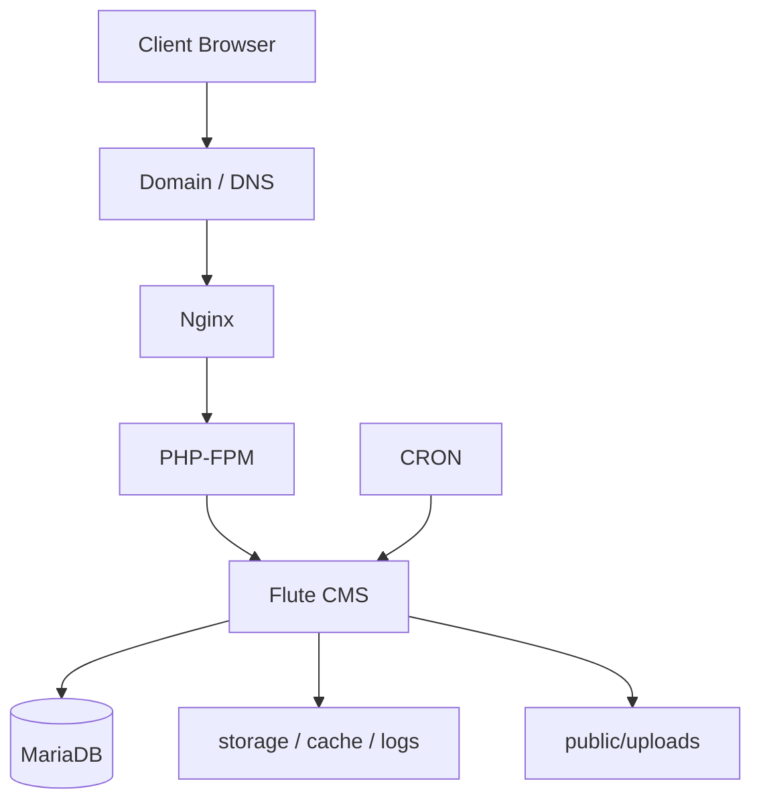

# Flute CMS на VPS — deployment case

> Практический кейс установки, настройки и сопровождения **Flute CMS** на **Ubuntu VPS** с использованием **Nginx, PHP-FPM, MariaDB, SSL и CRON**.

## О проекте

Этот репозиторий **живой кейс**, а не абстрактная инструкция.

Здесь собран понятный гайд по развёртыванию сайта на **Flute CMS** на обычном VPS, с акцентом на те вещи, которые действительно ломают установку в реальной среде:

- неправильный `document root`
- ошибки в `nginx` конфиге
- неверный `php-fpm` socket
- проблемы с правами на `storage/` и `public/uploads/`
- отсутствие корректно настроенного `CRON`

Репозиторий подходит и как:

- **пошаговый гайд** для своей установки
- **техническая документация** по уже поднятому проекту

---

## Live project

Сайт уже работает в реальной среде и показывает типичный кейс для игрового комьюнити: на главной доступны разделы **Home, Servers, News, Wiki, Portfolio**, а также переключение на несколько языков. citeturn678575view0

**Live site:** `https://subcultura.fun`

---

## Что важно по Flute CMS

По официальной документации Flute CMS для корректной установки нужны PHP 8.2+, поддерживаемая БД и корректная настройка веб-сервера; среди поддерживаемых вариантов указаны MySQL 8.0 / MariaDB 10.11+, PostgreSQL 14+, SQLite 3.30+, а для веб-сервера — в том числе Nginx 1.20+. citeturn275093view0

Ключевой момент для развёртывания — **веб-сервер должен смотреть в `public/`, а не в корень проекта!!!**. Для Nginx в документации Flute прямо используется `root /var/www/flute-cms/public;` и маршрутизация через `try_files $uri $uri/ /index.php?$query_string;`. citeturn397070view0turn397070view1

Для фоновых задач Flute использует команду `php flute cron:run`, а в SSH-варианте документация рекомендует запускать её каждую минуту через `crontab`. citeturn397070view3

---

## Что показывает этот кейс

Этот репозиторий демонстрирует:

- подготовку Ubuntu VPS под PHP/CMS-проект
- настройку `nginx` под Flute CMS
- работу с `php-fpm`
- базовую интеграцию с MariaDB
- выпуск и использование SSL
- настройку фоновых задач через CRON
- базовую диагностику типовых ошибок `404`, `500`, прав доступа и маршрутизации
- оформление deployment-процесса в понятный GitHub-репозиторий

---

## Стек

- **Ubuntu 22.04 LTS**
- **Nginx**
- **PHP 8.3 / PHP-FPM**
- **MariaDB**
- **Let’s Encrypt / SSL**
- **CRON**
- **Flute CMS**

> В документации Flute примеры часто показаны на PHP 8.2, но если на сервере используется PHP 8.3, в конфиге нужно указывать уже актуальный сокет, например `php8.3-fpm.sock`! Официальный пример с `try_files` и `fastcgi_pass` есть в документации веб-сервера. citeturn397070view1

---

## Что внутри репозитория

```text
.
├── README.md
├── configs
│   └── nginx
│       └── subcultura.fun.example.conf
├── docs
│   ├── 01-project-summary.md
│   ├── 02-server-preparation.md
│   ├── 03-installation-guide.md
│   ├── 04-nginx-setup.md
│   ├── 05-cron-setup.md
│   ├── 06-maintenance-checklist.md
│   ├── 07-troubleshooting.md
│   └── architecture.md
├── screenshots
└── scripts
    └── flute-health-check.sh
```

На GitHub у репозитория уже есть нужная основа: `configs/nginx`, `docs`, `screenshots`, `scripts` и история коммитов, так что его удобно довести до состояния полноценного portfolio case. citeturn678575view2turn397070view6

---

## Как пользоваться этим репозиторием

### 1. Начать с обзора

Сначала открой:

- [`docs/01-project-summary.md`](docs/01-project-summary.md)
- [`docs/architecture.md`](docs/architecture.md)

Там коротко показано, как устроен проект и где критичные точки.

### 2. Подготовить VPS

Дальше перейти в:

- [`docs/02-server-preparation.md`](docs/02-server-preparation.md)

В этом разделе — базовая подготовка Ubuntu VPS, установка Nginx, PHP, MariaDB, SSL и первичная проверка окружения.

### 3. Установить Flute CMS

Основная инструкция:

- [`docs/03-installation-guide.md`](docs/03-installation-guide.md)

Если коротко, критичные моменты такие:

- проект размещается в каталоге приложения
- **web root** должен вести именно в `public/`
- после установки нужно проверить права, сокет PHP и работу маршрутов

### 4. Настроить Nginx

Использовать:

- [`docs/04-nginx-setup.md`](docs/04-nginx-setup.md)
- [`configs/nginx/subcultura.fun.example.conf`](configs/nginx/subcultura.fun.example.conf)

Официальная документация Flute для Nginx показывает именно такой подход: `root` на `public/`, `location /` с `try_files`, и обработку PHP через `fastcgi_pass`. citeturn397070view0turn397070view1

### 5. Настроить CRON

Использовать:

- [`docs/05-cron-setup.md`](docs/05-cron-setup.md)

Официальная команда Flute для CRON — `php flute cron:run`; в документации также показан SSH-вариант с записью в `crontab` на каждую минуту. citeturn397070view3

### 6. Проверить состояние сервера

Использовать:

- [`docs/06-maintenance-checklist.md`](docs/06-maintenance-checklist.md)
- [`docs/07-troubleshooting.md`](docs/07-troubleshooting.md)
- [`scripts/flute-health-check.sh`](scripts/flute-health-check.sh)

---

## Быстрый старт

### Подготовка окружения

```bash
sudo apt update && sudo apt upgrade -y
sudo apt install -y nginx mariadb-server unzip curl git ca-certificates
```

### Установка PHP и расширений

```bash
sudo apt install -y \
  php8.3 php8.3-cli php8.3-fpm php8.3-mysql php8.3-curl \
  php8.3-mbstring php8.3-xml php8.3-zip php8.3-gd \
  php8.3-bcmath php8.3-gmp
```

### Проверка сервисов

```bash
systemctl status nginx
systemctl status php8.3-fpm
systemctl status mariadb
```

### Критически важная мысль

```bash
/var/www/html/public
```

Именно эта папка должна быть `root` для сайта.

---

## Типовая схема работы



---

## Реальные инженерные задачи, которые покрывает этот кейс

Этот репозиторий полезен не только как "как поставить CMS", но и как пример того, что ты умеешь:

- поднимать сайт на VPS с нуля
- работать с Linux-сервисами
- настраивать `nginx` server blocks
- разруливать ошибки `404` и `500`
- проверять `php-fpm`, сокеты, права и логи
- оформлять инфраструктурную работу в понятную техдокументацию

Для портфолио это выглядит заметно сильнее, чем просто написать "ставил Flute CMS".

---

## Что ещё можно улучшить

Чтобы репозиторий выглядел ещё сильнее, можно добавить:

- реальные скриншоты сайта в `screenshots/`
- отдельный раздел **Lessons learned**
- backup / restore инструкции
- примеры обновления Flute CMS
- схему DNS / SSL / Cloudflare, если это используется
- список типовых команд диагностики в одном cheat-sheet файле

---

## Для кого подойдёт этот репозиторий

- владельцам игровых сайтов на VPS
- тем, кто разворачивает Flute CMS впервые
- тем, кто хочет оформить GitHub под DevOps / Linux / Support / Sysadmin задачи
- тем, кто хочет показать **не учебный, а реальный кейс**

---

## Полезные ссылки

- **Live site:** `https://subcultura.fun`
- **Flute CMS docs:** `https://docs.flute-cms.com/ru`
- **Repository:** `https://github.com/cultura1337/vps-website-setup`

---
