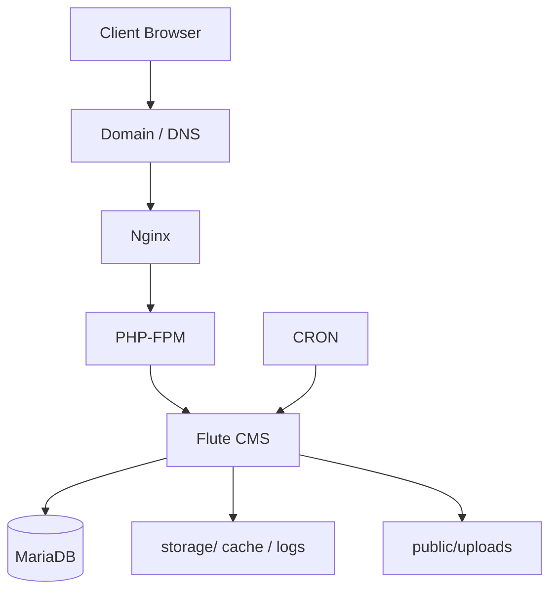

# Архитектура

## Кратко

- **Nginx** принимает HTTP/HTTPS-запросы
- **PHP-FPM** обрабатывает PHP
- **Flute CMS** отвечает за приложение
- **MariaDB** хранит данные
- **CRON** запускает фоновые задачи
- **public/** — единственная директория, которую должен видеть веб-сервер
